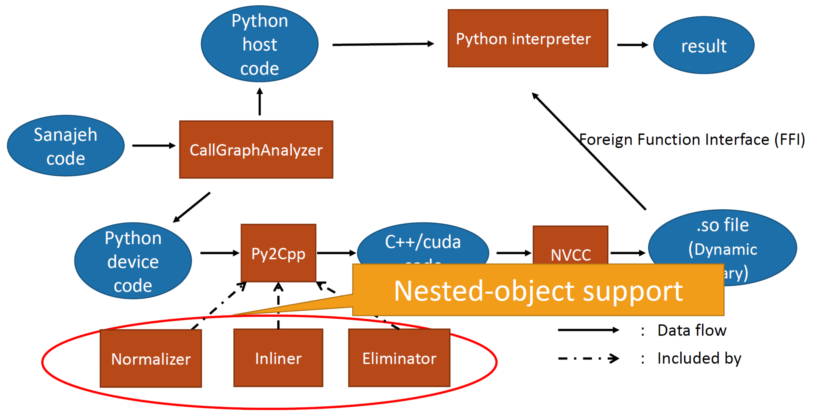

# Sanajeh
A DSL for GPGPU programming with Python objects.

# Design



An SMMO program written in Sanajeh is split into two different python files. The first one contains the class definitions (device code) and the second one contains the *main* function that instantiates the objects and call the methods.

Sanajeh analyzes the class definitions and uses an analyzer to separate *.cu* and *.h* definitions. From there, these are compiled into *.so* files. The separate *main* function runs the SMMO program by calling the *.so* files through FFI.

# Compilation

The examples are defined in
````
/examples
````
Inside, the only one working properly for now is nbody which can be found in `/examples/nbody/`. The file `nbody.py` contains the class definitions and the file `main_norender.py` contains the *main* function that instantiates the objects and call the methods on all objects.

The build script for nbody can be found in `/build_scripts/nbody.py` where it uses the class `PyCompiler` to compile the class definitions `nbody.py` into *.cu*, *.h*, *.so* files.

````python
from sanajeh import PyCompiler

compiler: PyCompiler = PyCompiler("examples/nbody/nbody.py", "nbody")
````

The build script needs to specify the path of the file to be compiled. The result of the compilation is put in `/device_code/(dir_name)` where `dir_name` is also specified by the script. 

The class `PyCompiler` can be found in `/src/sanajeh.py`. It uses definitions in `/src/py2cpp.py` to do the compilation.

## DeviceAllocator

The class definitions `nbody.py` also imports the class `DeviceAllocator` from `sanajeh.py`. This class is only a placeholder for methods that can only be found in DynaSOAr such as `curand_init` and `curand_uniform`.

````python
def Body(self, idx: int):
    DeviceAllocator.rand_init(kSeed, idx, 0)
    self.pos = Vector(2.0 * DeviceAllocator.rand_uniform() - 1.0,
                        2.0 * DeviceAllocator.rand_uniform() - 1.0)
    self.vel = Vector(0.0, 0.0)
    self.force = Vector(0.0, 0.0)
    self.mass = (DeviceAllocator.rand_uniform() / 2.0 + 0.5) * kMaxMass

def compute_force(self):
    self.force.to_zero()
    DeviceAllocator.device_do(Body, Body.apply_force, self)    
````

# Runtime

The *main* function for nbody is defined in `/example/nbody/main_norender.py`. It uses the class `PyAllocator` which is also defined in `sanajeh.py`. `PyAllocator` works by calling the FFI.

`initialize()` sets up the FFI.

````
from sanajeh import PyAllocator
from nbody import Body
allocator: PyAllocator = PyAllocator("nbody")
allocator.initialize()
````

`parallel_new(...)` instantiates the objects.

````
obn = int(sys.argv[1])
itr = int(sys.argv[2])
allocator.parallel_new(Body, obn)
````

`parallel_do(...)` runs the SMMO. There are two methods here: compute_force and body_update.

````
allocator.parallel_do(Body, Body.compute_force)
allocator.parallel_do(Body, Body.body_update)
````